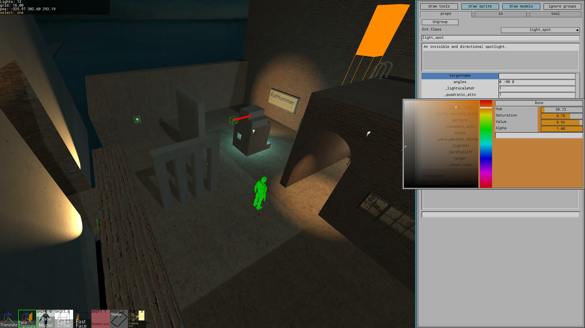

# An alternative to the Hammer editor.
[Download Alpha Build](https://github.com/nmalthouse/rathammer/releases)

[Documentation](doc/start.md)



## Getting vbsp.exe, fgd files, etc on Linux
* You may have to install the SourceSdk or game authoring tools using Proton.
* Install the game you want to map for using proton. I will use tf2 as an example. Right click -> properties -> compatibility -> check and select Proton
* Navigate to the game's steam folder "steamapps/common/Team Fortress 2"
* Copy the "bin" folder somewhere. 'cp -r bin /mnt/flash/tf2_bin'
* Turn off proton for the game and let it update.
* Copy the bin folder back to the game folder but name it BIN. 'cp -r /mnt/flash/tf2_bin BIN'
* See the 'tf2' config in config.vdf for how to configure everything.
Vbsp etc require some steam dlls to run properly. On Linux all paths are case sensitive, on Windows/wine they are not. So BIN and bin look the same to Windows but not Linux.

If you are mapping for Half-Life 2, there is a trick.
* Check 'show tools' in Steam. 
* Install Half-Life 2 Episode 2 (only shows up with tools) using Proton.
* Install the regular Half-Life 2 as a native Linux game.
* Install the SourceSdk using Proton.
* Check that steamapps/common/Half-Life 2/ contains both a hl2.exe and hl2_linux. There should also be a halflife2.fgd file in the bin folder

If running on Linux a few helpful tips.
In the ./scripts directory there is a script named run_hl2.sh.
This script will launch hl2 without needing steam open. If you send suspend signal 'ctrl-z in terminal', 

hl2 will be suspended and not use cpu/gpu while you map. unsuspend with 'fg' command

You will need to manually edit this script so the paths are correct.

Second, wine is very slow to startup by default, 'running wineserver --persistent' will speed up compile times significantly.

### Building from source
* (debian) Download the correct zig 0.14.1 tar from [zig](https://ziglang.org/download/)
* (debian) Install the dependencies listed under [sdl linux](https://github.com/libsdl-org/SDL/blob/main/docs/README-linux.md)
* Follow the instructions below for building

On arch it should just work

### Building and running
```
git clone https://github.com/nmalthouse/rathammer.git
cd rathammer
git submodule update --init --recursive
cd ratgraph
./setup_libs.sh
cd ..
zig build

# Example, running with hl2
./zig-out/bin/rathammer --custom_cwd ~/.local/share/Steam/steamapps/common --map my_maps/my_hl2map.vmf

# This will load a vmf map. When we save the map with ctrl+s, a file named my_hl2_map.json will be written to the my_maps directory.
The vmf file is not touched.
After closing the editor, to continue editing our map, we must use --map my_maps/my_hl2_map.json

The file 'config.vdf' defines various game configurations. The default is basic_hl2, which searches the set cwd for a directory named Half-Life 2
See config.vdf for defining other game configs.


/zig-out/bin/mapbuilder --map dump.vmf --gamedir Team\ Fortress\ 2 --gamename tf --outputdir tf/maps
```

### Planned
* Gui dark mode.
* Displacement tool.
* Multi map tabs.
* Editing multiple faces or entities at once in the inspector.
* Drawing decals.


### Style stuff.
Fields beginning with an underscore are private fields and should not be modified or read directly
