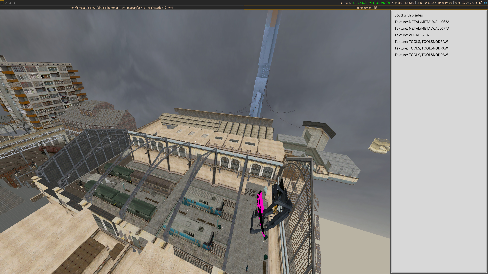

# Hammer editor.
Wip

## Implemented: 
* loading of vmf, vpk, vmt, vtf, mdl, vvd, gameinfo, fgd 
* rendering of csg, models, point entities, skybox
* translation of solids and entities
* basic inspection
* Texture and model browsing
* undo/redo
* serializing to json
* model placement
* asset browsing
* Writing vmf files.

## TODO
* Writing obj files
* alpha sorting
* Translation and rotation about arbitrary axis
* Write documentation



### Arch linux based distro
```
# install dependencies zig 0.14.1
sudo pacman -S zig libepoxy freetype2 sdl3 zenity

# optionally, for map compilation
sudo pacman -S wine
```

### Debian based distro (untested)
```
sudo apt-get install libsdl3-dev libepoxy-dev
# Download the correct zig 0.14.1 tar from https://ziglang.org/download/
# Follow the instructions below for building
```

### Windows
```
I don't fully remember. Download msys2 and mingw, install a bunch of packages like sdl, freetype, libz etc.
Download zig from https://ziglang.org/download/
Keep running zig build and installing missing packages with msys until it builds lol.
```


## Info for linux
When installing source engine games on Linux, the version using proton must be used in order to get the 
development tools such as vvis, vbsp etc. The fgd files are also only available in the windows builds.
For half-life 2 do the following:
* Own half-life 2 and the episodes
* Enable 'tools' checkbox in your steam library, this will show both the sourcesdk and Half-life 2 episodes
* Install Half-life 2 as a native Linux game
* Install Half-life 2:Episode 2 with proton. Right click -> properties -> compatibility -> check and select latest stable proton (9.0-4 as of writing)
* Instal source sdk using proton as well.
If you cd into your steamapps/common/Half-Life 2/ directory, you should see both a hl2_linux and hl2.exe binary


If running on linux a few helpful tips.
In the ./scripts directory there is a script named run_hl2.sh.
This script will launch hl2 without needing steam open. If you send suspend signal 'ctrl-z in terminal', 
hl2 will be suspended and not use cpu/gpu while you map. unsuspend with 'fg' command
You will need to manually edit this script so the paths are correct.

Second, wine is very slow to startup by default, 'running wineserver --persistent' will speed up compile times significantly.


### Building and running
```
git clone https://github.com/nmalthouse/rathammer.git
cd rathammer
git submodule update --init --recursive
zig build

# Example, running with hl2
./zig-out/bin/rathammer --custom_cwd ~/.local/share/Steam/steamapps/common --vmf my_maps/my_hl2map.vmf

# This will load a vmf map. When we save the map with ctrl+s, a file named my_hl2_map.json will be written to the my_maps directory.
The vmf file is not touched.
After closing the editor, to continue editing our map, we must use --vmf my_maps/my_hl2_map.json

The file 'config.vdf' defines various game configurations. The default is basic_hl2, which searches the set cwd for a directory named Half-Life 2
See config.vdf for defining other game configs.


/zig-out/bin/mapbuilder --vmf dump.vmf --gamedir Team\ Fortress\ 2 --gamename tf --outputdir tf/maps
```


### Style stuff.
Fields beginning with an underscore are private fields and should not be modified or read directly
